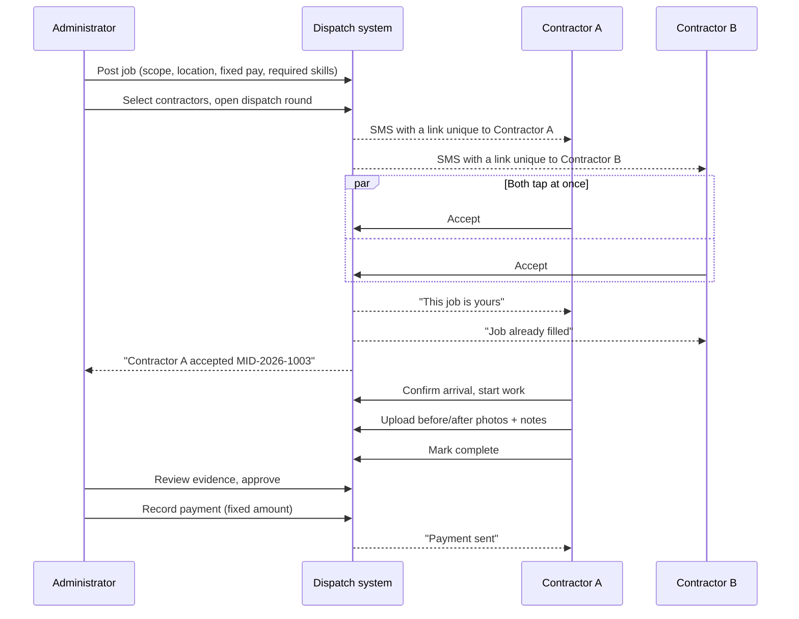

# MACA Consultants Install Dispatch

Private job-dispatch system for SSDC installations and other field work.

An administrator posts a job with a defined scope and a fixed contractor
payment. Eligible approved contractors are texted a secure link and can accept
or pass. **The first eligible contractor to accept is assigned the job** — and
exactly one can win, guaranteed at the database level. The job is then tracked
through installation, completion review, and payment.

---

## Contents

- [How it works](#how-it-works)
- [Architecture](#architecture)
- [Data model](#data-model)
- [The single-winner guarantee](#the-single-winner-guarantee)
- [Security model](#security-model)
- [Local setup](#local-setup)
- [Supabase setup](#supabase-setup)
- [Twilio setup](#twilio-setup)
- [Deploying to Vercel](#deploying-to-vercel)
- [Tests](#tests)
- [Seeded accounts](#seeded-accounts)
- [Deliberate limitations](#deliberate-limitations)

---

## How it works



### Job statuses

`Draft` → `Ready` → `Offered` → `Assigned` → `In Progress` → `Completed` →
`Approved` → `Paid`

with `Needs Rework` (back to the contractor), `On Hold`, `Cancelled`, and
`Unfilled` (every offer expired or was passed) as the exceptional states.

---

## Architecture

| Layer | Choice |
| --- | --- |
| Framework | Next.js 15, App Router, React 19, TypeScript strict |
| Data | Supabase Postgres, row-level security on every table |
| Auth | Supabase Auth — password for admins, SMS magic link for contractors |
| Files | Supabase Storage, three private buckets, short-lived signed URLs |
| SMS | Twilio REST API, with a development driver that sends nothing |
| Hosting | Vercel, including a cron for the offer-expiry sweep |
| Styling | Tailwind CSS v4, mobile-first |

### Where the rules live

Business rules are enforced **in the database**, not in the application:

- State transitions run through `SECURITY DEFINER` functions that re-check
  ownership and current status server-side.
- Contractors hold no `UPDATE` privilege on `jobs` at all.
- Contractor pay is frozen by trigger the moment a job is dispatched.
- The audit log is append-only, enforced by trigger — no code path, and no
  administrator, can rewrite history.

This means a bug in a route handler cannot corrupt a job, and a second client
(a mobile app, a script, a future integration) inherits the same guarantees for
free.

```
src/
  app/
    sign-in/                     Admin password + contractor SMS link
    auth/link/[token]/           Redeems a single-use sign-in token
    offer/[token]/               The SMS offer page — accept, pass, ask
    (contractor)/
      jobs/                      Offers, assigned work, on-site flow
      account/                   Availability, skills, service areas, SMS prefs
    admin/
      jobs/                      Post, edit, dispatch, review, pay
      contractors/               Roster, approval, certifications, notes
      messages/  activity/       SMS log, audit trail
      export/                    CSV for jobs and payments
    api/
      cron/expire-offers/        Scheduled sweep
      twilio/status/             Delivery-status webhook (signature verified)
  lib/
    dispatch.ts                  Opening rounds, notification fan-out
    offers.ts                    Reading an offer from its token
    passwordless.ts              Token → real Supabase session exchange
    sms/                         Driver interface, Twilio, dev, templates
supabase/
  migrations/                    0001–0010, applied in order
  seed.sql                       One admin, six contractors, six jobs
test/
  concurrency.test.mjs           Simultaneous acceptance
  permissions.test.mjs           RLS and eligibility
  workflow.test.mjs              Full lifecycle
  shim/supabase_shim.sql         Supabase platform shim for local Postgres
```

---

## Data model

Fifteen tables. The ones that carry the most weight:

**`jobs`** — everything about a job, including its fixed
`contractor_pay_cents`, its schedule, its assignee, and the timestamps for
every lifecycle transition. Constraints make illegal states unrepresentable:
an assignment is always a `(contractor, timestamp)` pair or neither, a job
cannot be `paid` without having been `approved`, and any status from `assigned`
onward requires an actual assignee.

**`job_offers`** — one row per (job, contractor, dispatch round). Holds the
SHA-256 of the link token, the expiry, delivery state, and the response. This
table is the *only* way a contractor learns a job exists.

**`audit_log`** — append-only. Written by database triggers on status changes,
assignments, repricing attempts and payments, so the trail cannot be bypassed
by a code path that forgets to log.

**`sms_messages`** — every outbound message, written *before* the provider is
called, so a crash mid-send still leaves evidence.

Supporting: `profiles`, `contractors`, `contractor_notes` (admin-only, split
into its own table so RLS can hide it), `skills`, `contractor_skills`,
`job_skills`, `service_areas`, `contractor_service_areas`,
`contractor_documents`, `job_attachments`, `login_tokens`.

---

## The single-winner guarantee

This is the part of the system that has to be right.

`accept_offer_core()` funnels every competing acceptance for a job through a
`SELECT … FOR UPDATE` on that job's row:

```sql
select * into v_job from public.jobs j where j.id = v_offer.job_id for update;
```

The first transaction to arrive takes the lock and flips the status to
`assigned`. Every other transaction blocks there. Under `READ COMMITTED`, a
blocked statement re-reads the row once the lock clears, so the losers observe
the winner's committed status and fall through to `already_filled`.

The guarded `UPDATE` that follows is a **second, independent barrier**:

```sql
update public.jobs j
   set status = 'assigned', assigned_contractor_id = v_offer.contractor_id, ...
 where j.id = v_job.id
   and j.status = 'offered'
   and j.assigned_contractor_id is null;
```

Its `WHERE` clause matches only an unassigned, still-offered job, so even if
the lock reasoning were wrong, at most one statement can report a row count of
1. Both paths into acceptance — the SMS link and the signed-in job list — call
this same function body, so the guarantee cannot hold on one and not the other.

Before any of that, the function checks that the contractor is **active**,
**approved**, and holds **every skill the job requires**, and that neither the
offer nor the job's dispatch window has expired.

This is not asserted, it is tested — see [Tests](#tests) for the 16-way race,
the ten consecutive races, and the in-app equivalent.

---

## Security model

**Offer links.** 256 bits of entropy, base64url encoded, unique per contractor
per round. Only the SHA-256 is stored, so a database leak yields no working
links. Job pages are UUID-addressed and RLS-gated — there are no guessable job
URLs. The `/offer/*` routes send `noindex` and `no-referrer`.

**Passwordless sign-in.** The SMS link carries our own single-use, expiring
token. The server verifies it and then mints a *genuine* Supabase session via
the admin API. That matters: row-level security keys off the JWT, so a
hand-rolled session cookie would force every query to run as the service role
and RLS would protect nothing.

**Row-level security.** Default-deny on all fifteen tables. A contractor can
see a job only when it is assigned to them or has been offered to them. They
cannot see the competing roster, the audit log, outbound SMS, or the internal
notes written about them. Nobody reads `login_tokens` — not even an
administrator.

**Privilege separation.** The service-role key is used in exactly three places,
all of which genuinely have no user session to act under: verifying a sign-in
token, writing dispatch offers and SMS records, and the expiry sweep. Route
protection lives in pages and RLS rather than middleware, because middleware
runs before the app knows anything about the user.

**Storage.** All three buckets are private. Images are served through signed
URLs valid for ten minutes; a link copied out of the page stops working.
Authorization is by path — the first folder segment is the job or contractor
id, which the storage policies check.

**Webhooks.** The Twilio status callback verifies the `X-Twilio-Signature`
HMAC before touching delivery history.

---

## Local setup

Requires **Node 20.9+** and a **Supabase project** (free tier is fine).

```bash
git clone https://github.com/andyrodriguez2579-bot/Mall-Consultants-Install-Dispatch.git
cd Mall-Consultants-Install-Dispatch
npm install

cp .env.example .env.local
# Fill in the three Supabase values. Leave the Twilio block empty.

npm run dev
```

Open http://localhost:3000.

With `SMS_DRIVER=dev` (the default), **no Twilio account is needed**. Every
message is printed to the terminal with its secure link, so you can dispatch a
job in one window and paste the offer link into another to accept it:

```
┌────────────────────────────────────────────────────────────────
│ SMS (development mode — not sent)
│ To: +17135550201
├────────────────────────────────────────────────────────────────
│ MACA Consultants: new job MID-2026-1007
│ SSDC retrofit — Galleria corridor C
│ Houston, TX · Apr 20 · $680
│ First to accept gets it. Expires in 4h.
│ http://localhost:3000/offer/xQ8f2…
└────────────────────────────────────────────────────────────────
```

---

## Supabase setup

1. Create a project at [supabase.com](https://supabase.com).

2. Apply the migrations, in order. With the CLI:

   ```bash
   npm install -g supabase
   supabase link --project-ref <your-project-ref>
   supabase db push
   ```

   Or paste each file from `supabase/migrations/` into the SQL Editor in
   filename order, `0001` through `0010`.

3. Load the sample data (development projects only):

   ```bash
   supabase db execute --file supabase/seed.sql
   ```

4. Confirm the three private storage buckets exist — `job-photos`,
   `job-briefs`, `contractor-docs`. Migration `0009` creates them. **Leave them
   private**; the application signs URLs on demand.

5. Copy the URL, anon key and service-role key from Project Settings → API into
   `.env.local`.

### Creating the first administrator on a clean project

The seed file includes one, but for a production project:

```sql
-- 1. Create the auth user in Authentication -> Users (email + password), then:
insert into public.profiles (id, role, full_name, phone, email, is_active)
values ('<the-new-user-uuid>', 'admin', 'Your Name', '+15125550100', 'you@example.com', true);
```

Contractors are then added from **Admin → Contractors → Add a contractor**,
which creates the auth user and profile together.

---

## Twilio setup

Only needed to send real messages.

1. Buy a number, or create a Messaging Service (preferred — it handles number
   pooling and compliance).
2. Set in your environment:

   ```
   SMS_DRIVER=twilio
   TWILIO_ACCOUNT_SID=AC…
   TWILIO_AUTH_TOKEN=…
   TWILIO_MESSAGING_SERVICE_SID=MG…      # or TWILIO_FROM_NUMBER=+1…
   ```

3. For delivery confirmation, set the status callback on the Messaging Service
   or number to:

   ```
   https://your-domain.com/api/twilio/status
   ```

   Without it the message log tops out at "sent"; with it you get `delivered`,
   `undelivered` and `failed` per recipient, reflected on the offers table.

US A2P 10DLC registration is required before Twilio will deliver application
traffic to US numbers. Register the brand and campaign in the Twilio console
first, or messages will be filtered.

---

## Deploying to Vercel

1. Import the repository at [vercel.com/new](https://vercel.com/new). Framework
   preset and build settings are detected automatically.

2. Add environment variables (Project Settings → Environment Variables):

   | Variable | Notes |
   | --- | --- |
   | `NEXT_PUBLIC_SUPABASE_URL` | |
   | `NEXT_PUBLIC_SUPABASE_ANON_KEY` | |
   | `SUPABASE_SERVICE_ROLE_KEY` | **Mark as sensitive** |
   | `APP_BASE_URL` | Your production URL, e.g. `https://dispatch.example.com` |
   | `SMS_DRIVER` | `twilio` in production |
   | `TWILIO_ACCOUNT_SID` / `TWILIO_AUTH_TOKEN` | Mark the token as sensitive |
   | `TWILIO_MESSAGING_SERVICE_SID` *or* `TWILIO_FROM_NUMBER` | |
   | `OFFER_TTL_HOURS` | Optional, defaults to 4 |
   | `CRON_SECRET` | `openssl rand -base64 32` |

   `APP_BASE_URL` matters: it is what offer links point at. Without it, links
   fall back to the per-deployment `VERCEL_URL` and will not match your domain.

3. Deploy. `vercel.json` registers the expiry sweep at `*/15 * * * *`; Vercel
   supplies the `CRON_SECRET` as a bearer token automatically.

4. In Supabase → Authentication → URL Configuration, add your production domain
   to the redirect allow-list.

5. Point Twilio's status callback at the deployed URL.

> The expiry sweep is a convenience, not a safety net. Expiry is re-checked on
> every acceptance attempt, so a missed cron run can never let a stale offer be
> accepted — it only leaves the dashboard looking out of date.

---

## Tests

The suite runs against a **real PostgreSQL cluster**, not a mock. A local
cluster is created on demand and the *same* migration files that ship to
Supabase are applied on top of a small shim that recreates the platform pieces
they depend on (the `auth` and `storage` schemas, the `anon` / `authenticated`
/ `service_role` roles).

```bash
npm test          # rebuild the database, then run everything
npm run test:only # run against the current database
npm run db:psql   # open a psql session against it
```

51 tests:

**Concurrency (7)** — three-way and 16-way simultaneous races; ten consecutive
races, because a lost update is a timing bug and one clean pass proves little;
losing offers marked `filled`; late acceptance reporting "Job already filled";
the winner re-tapping their own link treated as idempotent rather than an
error; exactly one acceptance in the audit log per race.

**Permissions (35)** — job visibility per role; contractors holding no write
path to `jobs`; self-promotion and self-approval refused; the competing roster,
audit log, SMS records and internal notes all invisible; login tokens invisible
to everyone; every eligibility gate on acceptance (unqualified, pending,
suspended, deactivated, expired, another contractor's link); audit-log
immutability; pay immutability after dispatch; job numbers immutable; approval
and payment ordering enforced.

**Workflow (9)** — the full lifecycle from dispatch through payment; the rework
loop; the in-app acceptance race; the expiry sweep; re-offering in a second
round; cancellation closing out live offers; reassignment revoking the previous
contractor's access; pay staying fixed at every stage.

The races are genuinely parallel — N independent connections, all warmed
first so connection setup cannot stagger the calls and quietly serialise the
very thing under test.

---

## Seeded accounts

`supabase/seed.sql`, development only. Password for every account:
`DispatchDev!2026`

| Who | Sign in with | Standing |
| --- | --- | --- |
| Renee Alvarado (admin) | `admin@macaconsultants.test` | — |
| Marcus Webb | `+1 713 555 0201` | Approved, SSDC certified |
| Dana Ortiz | `+1 713 555 0202` | Approved, SSDC certified |
| Priya Raman | `+1 214 555 0203` | Approved, all certifications |
| Tom Beckett | `+1 713 555 0204` | Approved, **not** SSDC certified |
| Alicia Nunez | `+1 713 555 0205` | **Pending** approval |
| Ray Coleman | `+1 602 555 0206` | **Suspended** |

The last three exist to make the eligibility rules easy to see: Tom can hold an
offer but cannot accept an SSDC job, and Alicia and Ray cannot accept anything.

Job `MID-2026-1003` ships with four live offers whose links are reproducible:

```
/offer/seed-offer-marcus-development-only-do-not-reuse
/offer/seed-offer-dana-development-only-do-not-reuse
/offer/seed-offer-priya-development-only-do-not-reuse
/offer/seed-offer-tom-development-only-do-not-reuse
```

Open the first two in different browsers and race them — one gets the job, the
other gets "Job already filled". Open Tom's to see the eligibility gate refuse
an approved but uncertified contractor.

---

## Deliberate limitations

Worth knowing before this goes near production:

- **Payment is recorded, not processed.** No payment rail is integrated.
  `admin_mark_paid` writes the ledger entry confirming money was sent by
  whatever means the business already uses. The amount always comes from the
  job's frozen pay rather than from operator input, so the register cannot
  disagree with what the contractor accepted.

- **Contractors self-report their certifications.** The spec lists skills under
  contractor self-service, so `contractor_skills` is writable by its owner. That
  makes the qualification gate an honesty check backed by the documents on file,
  not a hard credential. If you would rather it were hard, remove the
  `contractor_skills_self_write` policy in migration `0008` and manage skills
  from the admin side only — everything else keeps working.

- **Service areas inform matching, they do not gate acceptance.** Skills are the
  hard requirement; geography is advisory, so an admin can always dispatch
  outside a contractor's declared area.

- **No offline mode.** A contractor in a basement plant room with no signal
  cannot upload photos. The camera capture works; the upload needs a connection.

- **`match_contractors_for_job` is unpaginated.** Fine to a few hundred
  contractors. Past that, add paging and a distance calculation rather than
  postal-prefix matching.
